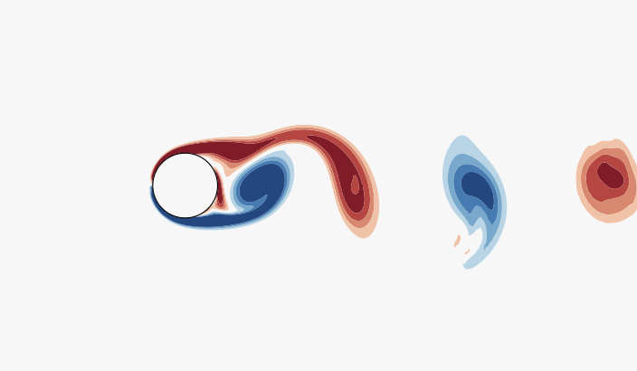
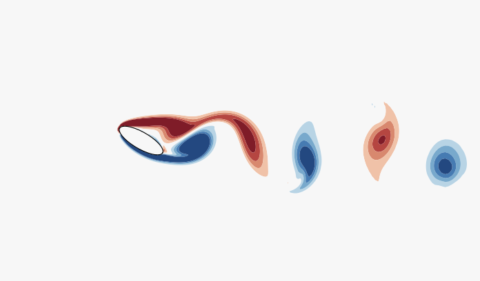
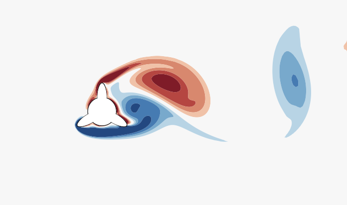

# ImmerseFlow++ : A C++ and CUDA Based Navier-Stokes Solver Using Sharp Interface Immersed Boundary Method

[](LICENSE)

## Overview

ImmerseFlow++ is a state-of-the-art Navier-Stokes solver designed to tackle fluid flow problems involving complex geometries and moving boundaries. By integrating the sharp interface immersed boundary method and leveraging the computational power of both CPU (C++) and GPU (CUDA) architectures, ImmerseFlow++ delivers high performance and scalability for solving intricate fluid dynamics scenarios.

## Features

- **2D and 3D Navier-Stokes Equations**: Comprehensive solution capabilities for both two-dimensional and three-dimensional fluid flow problems.
- **Sharp Interface Immersed Boundary Method**: Efficiently handle complex geometries and moving boundaries with high accuracy.
- **CUDA Acceleration**: Utilize GPU computing to achieve significant performance improvements.
- **Versatile Boundary Conditions**: Support for various boundary conditions and fluid properties to cater to a wide range of applications.
- **Visualization Tools**: Built-in tools for visualizing and analyzing simulation results.

## Contour Plots

### Contour Plot 1



In this simulation, we observe the fluid flow behavior at a Reynolds number of 300. The contour plot illustrates the streamline patterns and vorticity distribution, highlighting the intricate interactions between the fluid and immersed boundaries.

### Contour Plot 2



For a Reynolds number of 1000, the contour plot reveals more complex flow structures, including vortices and wake regions. This plot demonstrates the solver's capability to accurately capture the dynamics of higher Reynolds number flows.

### Contour Plot 3



At a Reynolds number of 1000, the fluid flow exhibits turbulent characteristics. The contour plot provides a detailed visualization of the turbulent eddies and flow separation, showcasing ImmerseFlow++'s robustness in handling highly dynamic fluid behaviors.

## Getting Started

### Prerequisites

- **CUDA Toolkit**: Ensure CUDA is installed on your system. [Download CUDA Toolkit](https://developer.nvidia.com/cuda-downloads)
- **C++ Compiler**: A standard C++ compiler compatible with CUDA.
- **CMake**: Build system generator. [Download CMake](https://cmake.org/download/)

### Installation

Clone the repository:
```bash
git clone https://github.com/yourusername/ImmerseFlow.git
cd ImmerseFlow
