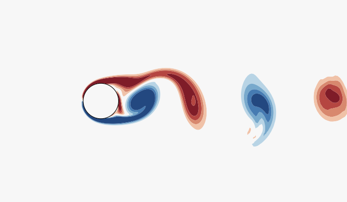
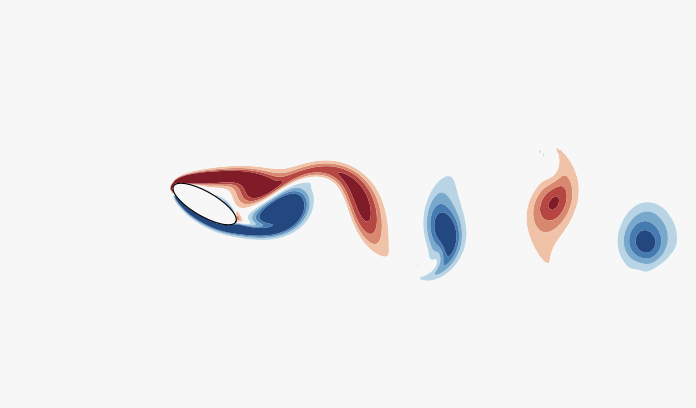
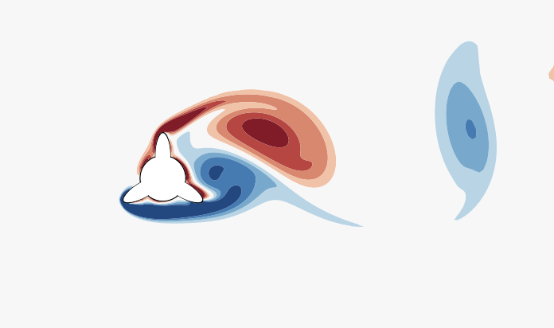

# ImmerseFlow++ : A C++ and CUDA Based Navier-Stokes Solver Using Sharp Interface Immersed Boundary Method

[](LICENSE)

## Overview

ImmerseFlow++ is a sharp-interface immersed boundary methods based Navier-Stokes solver designed to solve fluid flow problems involving complex geometries. The software code leverages the computational power of GPU architectures using custom CUDA kernels. Current effort focuses on utilizing CUDA aware MPI for increasing the scalability to multi-GPU cluster

## Features

- **Sharp Interface Immersed Boundary Method**: Efficiently handle complex geometries and moving boundaries with high accuracy.
- **CUDA Acceleration**: Utilize GPU computing to achieve significant performance improvements.
- **Versatile Boundary Conditions**: Support for various boundary conditions and fluid properties to cater to a wide range of applications.
- **Visualization Tools**: Built-in tools for visualizing and analyzing simulation results.

## Contour Plots

### Flow Past Cylinder at Re = 1000



In this simulation, we observe the fluid flow behavior at a Reynolds number of 1000. The contour plot illustrates the vorticity distribution, highlighting the intricate interactions between the fluid and immersed boundaries.

### Flow Past Elliptic Airfoil at Re = 300



For a Reynolds number of 300, the contour plot reveals flow structures for an elliptic airfoil, including vortices and wake regions. This plot demonstrates the solver's capability to accurately capture the flow dynamics around asymmetric bodies.

### Flow Past Elliptic Airfoil at Re = 300



At a Reynolds number of 300, the fluid flow exhibits complex pattern around very complex body shapes. The contour plot provides a detailed visualization of the flow separation, showcasing ImmerseFlow++'s robustness in simulating fluid behaviors around such complex shapes.

## Getting Started

### Prerequisites

- **CUDA Toolkit**: Ensure CUDA is installed on your system. [Download CUDA Toolkit](https://developer.nvidia.com/cuda-downloads)
- **C++ Compiler**: A standard C++ compiler compatible with CUDA.
- **CMake**: Build system generator. [Download CMake](https://cmake.org/download/)

### Installation

Clone the repository:
```bash
git clone https://github.com/yourusername/ImmerseFlow.git
cd ImmerseFlow
