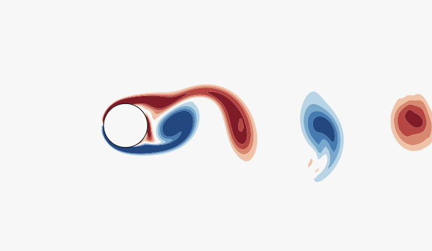
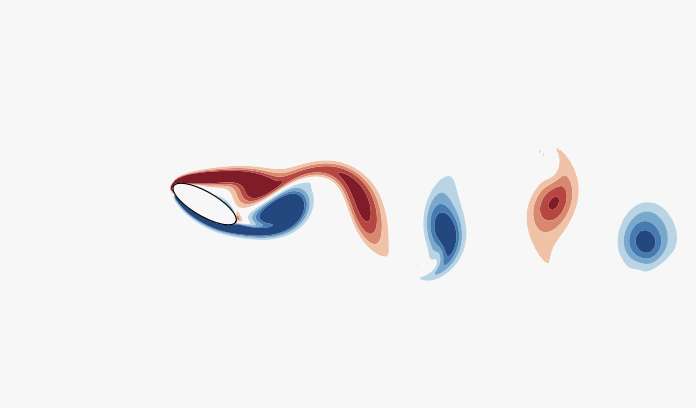
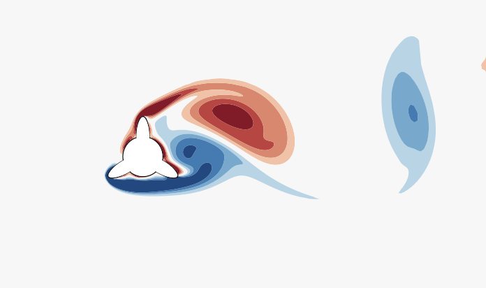

# ImmerseFlow++ : A C++ and CUDA Based Navier-Stokes Solver Using Sharp Interface Immersed Boundary Method

[](LICENSE)

## Overview

ImmerseFlow++ is a simplified implementation (using stair-step immersed boundary method) of the ViCar3D. 

A brief introduction of ViCar3D. It is almost a 30 year old legacy codebase that was reprogrammed by Sushrut Kumar as part of his PhD disseration to run over multi-GPU and multi-node setups. The condensed details can be read in this [paper](https://arxiv.org/abs/2505.17287) on ArXiV and the capabilites can be seen it this [paper](https://asmedigitalcollection.asme.org/fluidsengineering/article/147/3/030801/1210318/Freeman-Scholar-Lecture-2021-Sharp-Interface). The moto behind ViCar3D development was "simulate what you see or think". Hence, the complexity behind reprogramming was tremendous.

Currently, access to the codebase is limited to several early-career academics along with members of Prof. Rajat Mittal's lab at Johns Hopkins University. A reference to ImmerseFlow can be taken along with papers by Prof. Rajat Mittal by members of scientific community to develop their own numerical solvers. Please reach out to my advisor at mittal@jhu.edu for more details regarding ViCar3D.

## Features

- **2D and 3D Navier-Stokes Equations**: Comprehensive solution capabilities for both two-dimensional fluid flow problems. 3D in works
- **Sharp Interface Immersed Boundary Method**: Efficiently handle complex geometries and moving boundaries with high accuracy and exact application of Neumann pressure boundary conditions.
- **CUDA Acceleration**: Utilize GPU computing to achieve significant performance improvements.
- **Versatile Boundary Conditions**: Support for various boundary conditions and fluid properties to cater to a wide range of applications.
- **Visualization Tools**: Built-in tools for visualizing and analyzing simulation results.

## Contour Plots

### Contour Plot 1



In this simulation, we observe the fluid flow behavior at a Reynolds number of 300. The contour plot illustrates the streamline patterns and vorticity distribution, highlighting the intricate interactions between the fluid and immersed boundaries.

### Contour Plot 2



For a Reynolds number of 1000, the contour plot reveals more complex flow structures, including vortices and wake regions. This plot demonstrates the solver's capability to accurately capture the dynamics of higher Reynolds number flows.

### Contour Plot 3



At a Reynolds number of 1000, the fluid flow exhibits turbulent characteristics. The contour plot provides a detailed visualization of the turbulent eddies and flow separation, showcasing ImmerseFlow++'s robustness in handling highly dynamic fluid behaviors.

## Getting Started

### Prerequisites

- **CUDA Toolkit**: Ensure CUDA is installed on your system. [Download CUDA Toolkit](https://developer.nvidia.com/cuda-downloads)
- **C++ Compiler**: A standard C++ compiler compatible with CUDA.
- **CMake**: Build system generator. [Download CMake](https://cmake.org/download/)

### Installation

Clone the repository:
```bash
git clone https://github.com/yourusername/ImmerseFlow.git
cd ImmerseFlow
